# drone-nav-estimation

[](https://github.com/ThomasLabetouille/drone-nav-estimation/actions/workflows/tests.yml)

Simulation de capteurs et estimation d'état pour un drone à voilure fixe, en Python, avec un portage C++ prévu une fois les algorithmes validés.

Le projet avance par étapes. Chacune ajoute des capteurs ou des états au filtre et se valide avant de passer à la suivante. Les huit étapes sont faites :

1. la voie verticale : un filtre de Kalman qui fusionne un accéléromètre et un baromètre ;
2. la navigation inertielle en 3D : trajectoire de voilure fixe, IMU 6 axes, intégration strapdown, et l'erreur d'une IMU MEMS seule comparée à son budget analytique ;
3. un EKF à état d'erreur à 15 états qui fusionne l'IMU et le GNSS, avec ce qu'il apprend à chaque manœuvre et ce qu'il ne peut pas apprendre en ligne droite ;
4. un GNSS réaliste : erreurs corrélées dans le temps, estimées par trois états de plus, et 150 ms de latence gérée par un filtre à horizon retardé ;
5. les capteurs d'aide d'un drone à voilure fixe, dans 5 m/s de vent : magnétomètre, baromètre, tube de Pitot, et l'estimation du vent ;
6. les modes dégradés : perte et saut du GNSS, perturbation magnétique, test d'innovation et blocages qu'il peut provoquer ;
7. le rejeu de trois vrais vols PX4, comparé à l'EKF2 embarqué, avec ce que ces vols ont révélé sur leurs capteurs ;
8. le portage du filtre en C++ (matrices de taille fixe, aucune allocation dynamique), identique à la version Python à l'arrondi près sur les vols réels.

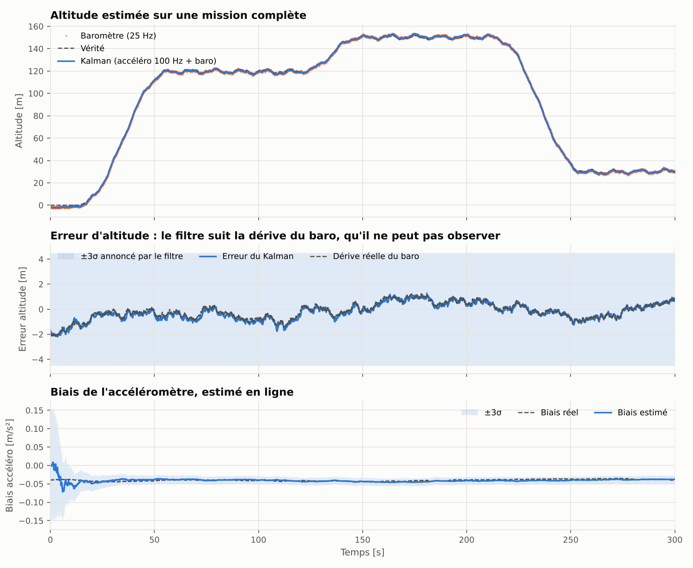

## Lancer

```bash
pip install -e ".[dev]"                # dont pyulog et pygeomag pour l'étape 7
python -m pytest                       # environ onze minutes
python scripts/step1_altitude.py       # étape 1, ~45 s
python scripts/step2_strapdown.py      # étape 2, ~50 s
python scripts/step3_eskf.py           # étape 3, ~2 min 30
python scripts/step4_gnss.py           # étape 4, ~5 min
python scripts/step5_aiding.py         # étape 5, ~40 min (--runs 10 : ~10 min)
python scripts/step6_degraded.py       # étape 6 et sa vidéo, ~1 h (--runs 10, --no-video)
python scripts/step7_replay.py         # étape 7, ~20 min, logs à télécharger (liens dans le script)
python scripts/step8_cpp.py            # étape 8 : C++ contre Python sur les mêmes logs, ~5 min (CMake, Eigen)
python scripts/step2_strapdown.py --runs 100   # plus rapide, moins de Monte-Carlo
python scripts/check_provenance.py     # les résultats de docs/ correspondent-ils au code actuel ?
python scripts/mutation_check.py       # les tests détectent-ils des bugs connus ? ~1 h 30
```

Les figures sont écrites dans `docs/img/`, les tableaux dans `docs/stepN_results.md`.

## Étape 1 : altitude, accéléromètre + baromètre

### Mission simulée

300 s de vol : 10 s immobile sur la catapulte, montée à 120 m, palier, montée à 150 m, palier, descente à 30 m. Les transitions sont des polynômes de degré 5 (jerk minimal), donc l'accélération reste continue. La turbulence verticale est une somme de trois sinusoïdes (périodes de 2 à 12 s, jusqu'à ~3 m/s²). La vérité terrain est analytique, ce qui garantit que `a = dv/dt` et `v = dh/dt` exactement. Un test le vérifie.

### Capteurs

| | Fréquence | Modèle d'erreur |
|---|---|---|
| Accéléromètre (axe vertical) | 100 Hz | bruit blanc 0,02 m/s²/√Hz, biais initial σ = 0,05 m/s² (≈ 5 mg), marche aléatoire 5·10⁻⁴ m/s²/√s |
| Baromètre | 25 Hz | bruit blanc σ = 0,4 m, dérive lente Gauss-Markov σ = 1,5 m, τ = 120 s |

La densité de bruit de l'accéléro est volontairement 10 à 20 fois au-dessus d'une fiche technique MEMS, pour représenter les vibrations moteur. La dérive du baro représente la météo, la température et l'erreur de prise de pression statique.

Simplification de cette étape : l'accéléro mesure directement l'accélération verticale, gravité retirée et attitude supposée parfaite. Le modèle strapdown complet arrive à l'étape 2.

### Filtre

État `[h, v, b_a]`, plus `d` (dérive baro) quand le filtre la modélise. L'accéléro sert d'entrée de commande à la prédiction, le baro sert de mesure (`z = h + d + bruit`).

- Le modèle est écrit en temps continu puis discrétisé exactement (méthode de Van Loan). Le réglage du filtre reste donc exprimé en unités physiques (densités de bruit, marches aléatoires) et ne dépend pas de la fréquence d'échantillonnage.
- La mise à jour se fait en forme de Joseph.
- À l'initialisation sur le premier point baro, l'erreur d'altitude vaut `bruit + d` et l'erreur sur `d` vaut `-d`. La covariance initiale contient donc un terme croisé négatif. Sans lui, le filtre est incohérent pendant les premières secondes.

Le code est dans `src/navsim/kf_altitude.py`.

### Trois scénarios

- **A** : baro sans dérive, filtre à 3 états. C'est le cas de référence, où le modèle du filtre correspond exactement à la simulation.
- **B** : baro avec dérive, filtre à 3 états qui l'ignore.
- **C** : baro avec dérive, filtre à 4 états qui la modélise.

### Résultats (50 runs Monte-Carlo par scénario)

<!-- source: docs/step1_results.md -->
| | A | B | C |
|---|---|---|---|
| RMSE altitude, baro brut [m] | 0,40 | 1,46 | 1,46 |
| RMSE altitude, Kalman [m] | 0,07 | 1,41 | 1,40 |
| RMSE Vz, vario baro filtré (τ = 1 s) [m/s] | 0,75 | 0,76 | 0,76 |
| RMSE Vz, Kalman [m/s] | 0,036 | 0,097 | 0,074 |
| NEES moyen sur [h, v] (attendu : 2) | 1,98 | 967 | 1,97 |
| Temps dans l'intervalle NEES à 95 % | 95 % | 0 % | 98 % |
| Fenêtres de 10 s où le NIS baro dépasse son seuil | 2,3 % | 41 % | 2,2 % |

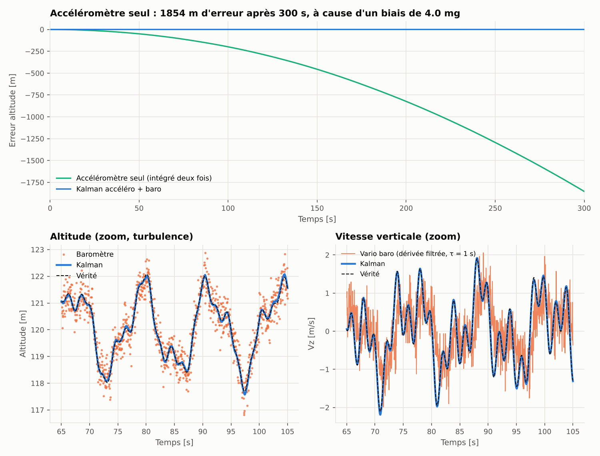

L'accéléromètre seul, intégré deux fois depuis l'état vrai, dérive de 76 m en 60 s et de près de 1,9 km en 300 s. Il suffit d'un biais de quelques mg. Le baro seul ne dérive pas autant, mais il est bruité, et sa dérivée est inutilisable sans filtrage, ce qui ajoute du retard. Le Kalman garde la dynamique de l'accéléro et la référence absolue du baro. Il estime aussi le biais de l'accéléro en ligne : en une trentaine de secondes, l'incertitude sur le biais passe de 0,05 à moins de 0,005 m/s².

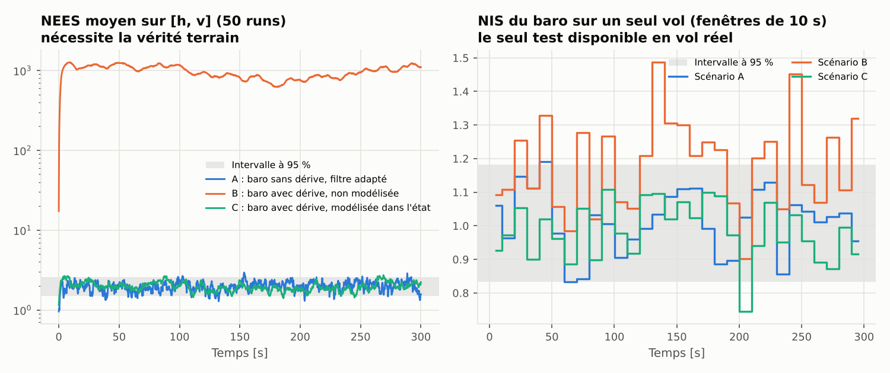

Avec une dérive du baro, l'altitude ne peut pas être meilleure que celle du baro, que le filtre la modélise ou non (1,40 m contre 1,41 m). Tant que le baro est la seule référence absolue, la dérive n'est pas observable. La différence entre B et C se joue sur la covariance :

- En B, le filtre annonce une incertitude de quelques centimètres alors que l'erreur réelle fait plus d'un mètre. Le NEES est à ~1000 au lieu de 2. Un filtre dans cet état rejetterait à tort une bonne mesure GNSS qui contredit le baro.
- En C, l'erreur est la même, mais la covariance la couvre (NEES ≈ 2).
- Sans vérité terrain, donc en vol réel, le seul indicateur est le NIS du baro. En B, il ne dépasse son seuil que dans 41 % des fenêtres de 10 s : sur un seul vol, la dérive non modélisée passe facilement inaperçue.

La seule façon d'observer cette dérive est d'avoir une deuxième référence d'altitude. C'est le rôle du GNSS dans les étapes suivantes.

### Écarts rencontrés

Dans une première version, l'accéléromètre simulé échantillonnait `a(t_k)`, alors que le filtre suppose une accélération constante sur `[t_k, t_k+1]`. Le scénario A, censé être parfaitement cohérent, donnait un NEES moyen de 2,09, avec 92 % du temps dans l'intervalle à 95 %. Le filtre était donc légèrement optimiste. J'ai corrigé en faisant sortir à l'accéléro simulé l'accélération moyenne sur la période (`Δv / dt`), comme le font les IMU qui fournissent des incréments de vitesse. Le NEES est alors passé à 1,98, avec 95 % du temps dans l'intervalle.

## Étape 2 : trajectoire 3D, IMU 6 axes, navigation inertielle

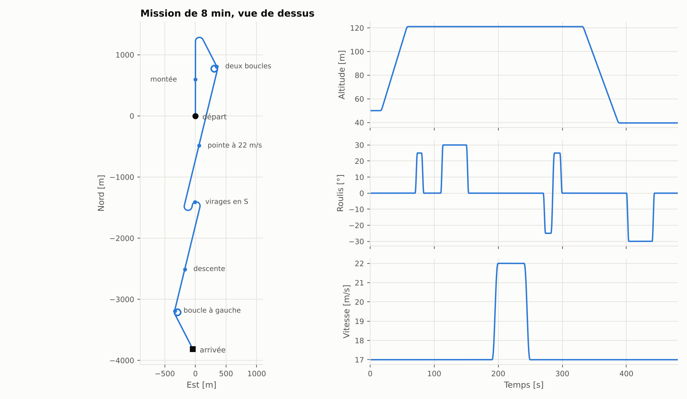

### Trajectoire et IMU idéale

Modèle cinématique, sans vent ni dérapage. Trois consignes, chacune construite avec les mêmes transitions à jerk minimal qu'à l'étape 1 : l'inclinaison, la pente et la vitesse air. Le cap suit la loi du virage coordonné, `dψ/dt = g tan φ / V`, et l'assiette vaut la pente plus un angle de calage constant de 3°.

Les vitesses angulaires et la force spécifique dans le repère avion ne dépendent pas du cap. Elles sont donc analytiques. Seuls le cap et la position demandent une intégration numérique, faite par la méthode de Simpson sur une grille 8 fois plus fine que l'IMU (1600 Hz).

L'IMU tourne à 200 Hz et sort des incréments, comme une vraie IMU : un incrément d'angle (intégrale de la vitesse angulaire) et un incrément de vitesse (intégrale de la force spécifique), tous deux dans le repère avion. Terre plate, repère NED, gravité constante, sans rotation terrestre. Le strapdown fait les mêmes hypothèses. Il faudra y revenir pour rejouer des logs réels.

Le code est dans `src/navsim/trajectory3d.py`, `src/navsim/rotations.py` (quaternions, conventions PX4) et `src/navsim/imu.py`.

### Strapdown, et ce qu'il reste avec une IMU parfaite

`src/navsim/strapdown.py` intègre les incréments selon trois variantes. Avec une IMU parfaite, l'erreur restante est celle de l'algorithme seul :

<!-- source: docs/step2_results.md -->
| Variante | Position après 8 min | Attitude, erreur max |
|---|---|---|
| naïve : `v += C(q) Δv` | 1,14 m | 5·10⁻⁵ ° |
| + compensation de rotation `½ Δθ × Δv` | 0,29 m | 5·10⁻⁵ ° |
| + corrections de coning et de sculling à deux échantillons | 0,0084 m | 3·10⁻⁸ ° |

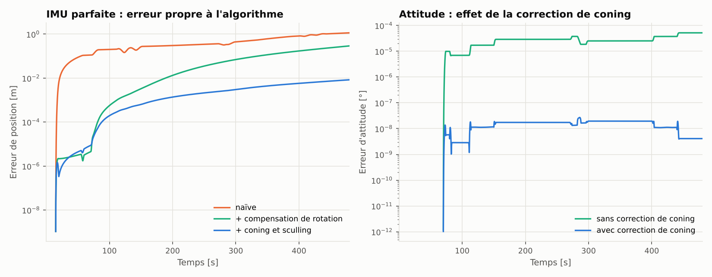

L'incrément d'angle mesuré est l'intégrale de la vitesse angulaire, pas la rotation exacte sur l'intervalle. Les deux diffèrent quand l'axe de rotation bouge (coning), ce qui arrive ici à chaque mise en virage. La compensation de rotation et le sculling corrigent l'équivalent pour la vitesse.

Avec cette dynamique douce et une IMU à 200 Hz, même la variante naïve reste très loin sous l'erreur des capteurs (1 m contre des centaines). Les corrections pèsent davantage avec des vibrations ou une IMU plus lente, que cette simulation ne modélise pas encore. Un test compare les trois variantes et exige que chaque correction réduise l'erreur, ce qui verrouille le signe des termes : un produit vectoriel inversé rendrait la variante complète moins bonne que la précédente.

### IMU MEMS seule, comparée au budget d'erreur

| | Bruit blanc | Biais initial | Marche aléatoire du biais |
|---|---|---|---|
| Gyromètres | 0,01 °/s/√Hz (0,6 °/√h) | 0,02 °/s (72 °/h) | 2·10⁻⁵ rad/s/√s |
| Accéléromètres | 0,02 m/s²/√Hz | 0,05 m/s² (≈ 5 mg) | 5·10⁻⁴ m/s²/√s |

Chaque axe a ses propres tirages. Les valeurs sont celles d'une IMU MEMS grand public non calibrée en vol, avec les vibrations incluses dans le bruit.

En vol rectiligne, en partant de l'état vrai, chaque source d'erreur donne une loi de croissance connue de l'erreur de position horizontale, par axe. Une erreur d'inclinaison δ fait lire à l'accéléromètre `g·δ` à l'horizontale, d'où le facteur `g` et les deux intégrations de plus pour les gyros :

| Source | Erreur de position par axe |
|---|---|
| biais accéléro `b_a` | `b_a t²/2` |
| biais gyro `b_g` | `g b_g t³/6` |
| bruit accéléro `N_a` | `N_a √(t³/3)` |
| bruit gyro `N_g` | `g N_g √(t⁵/20)` |
| dérive du biais accéléro `K_a` | `K_a √(t⁵/20)` |
| dérive du biais gyro `K_g` | `g K_g √(t⁷/252)` |

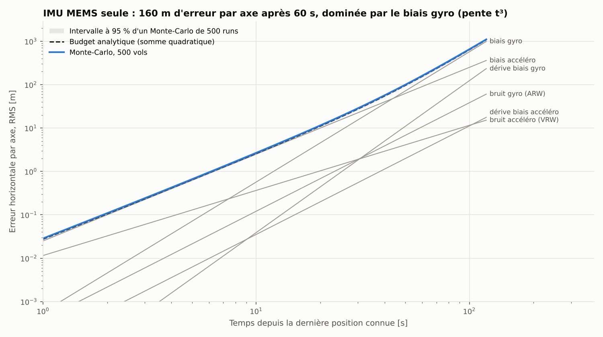

Sur 500 vols simulés, l'erreur RMS colle au budget à 2–4 % près de 10 à 120 s, ce qui reste dans l'intervalle de ±6 % attendu pour une RMS estimée sur 500 tirages. Elle atteint 160 m par axe à 60 s et 1,1 km à 120 s. Au-delà de 45 s environ, c'est le biais gyro qui domine : c'est lui que la fusion GNSS devra estimer en premier.

Le cap a un statut à part. Un biais sur le gyro de lacet fait dériver le cap, mais en vol rectiligne non accéléré la force spécifique est verticale, et tourner le cap ne change rien à la position. Un test le vérifie : 0,05 °/s de biais donne 6° d'erreur de cap en 120 s et moins de 50 cm d'erreur de position. Le cap n'est donc pas observable en ligne droite avec une IMU et un GNSS seuls. Il le devient dans les virages et les accélérations, ou avec un magnétomètre.

### Écarts rencontrés

Dans le test du virage stabilisé, j'attendais une force latérale nulle, puisque le virage est coordonné. Le test a mesuré 6,7 mm/s². La loi `dψ/dt = g tan φ / V` suppose une portance perpendiculaire à la trajectoire, mais avec 3° d'assiette l'axe latéral de l'avion n'est plus exactement horizontal. Il reste alors `g sin φ (1 − cos θ)`, soit 6,7 mm/s² à 30° d'inclinaison. C'est sans conséquence, parce que la vérité et l'IMU restent exactement cohérentes entre elles. Le test vérifie maintenant cette valeur exacte au lieu de zéro.

## Étape 3 : EKF à état d'erreur, IMU + GNSS

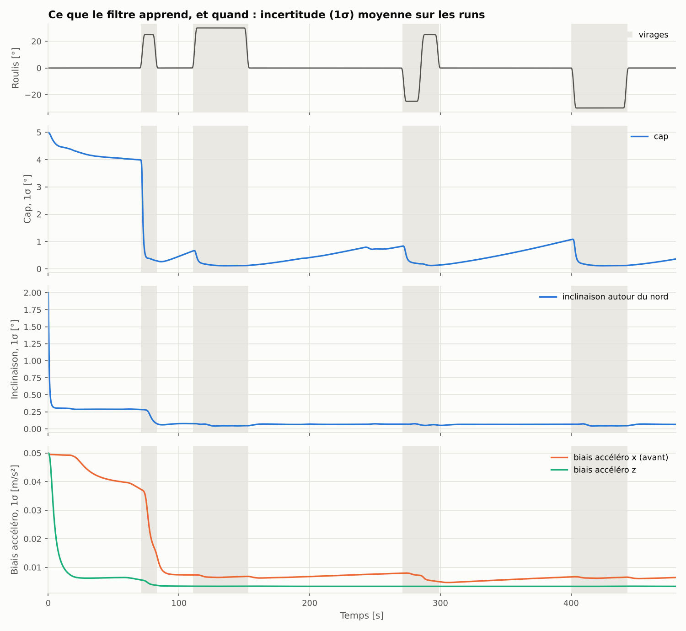

### Filtre

L'état nominal (position, vitesse, quaternion d'attitude, biais gyro, biais accéléro) est propagé par le strapdown de l'étape 2, avec des incréments corrigés des biais estimés. Le filtre estime l'erreur de cet état nominal, définie comme vérité moins nominal, sur 15 états :

```
δx = [δp, δv, δθ, δb_g, δb_a]          q_vrai = exp(δθ) ⊗ q_nominal,  δθ en NED

d(δp)/dt = δv
d(δv)/dt = −[f_n ×] δθ − C δb_a + C n_a
d(δθ)/dt = −C δb_g + C n_g
d(δb)/dt = marche aléatoire
```

Le terme `−[f_n ×] δθ` rend l'attitude observable à partir de la position et de la vitesse : une erreur d'attitude fait projeter une partie de la force spécifique sur le mauvais axe. En vol rectiligne non accéléré, `f_n` est verticale, et une erreur de cap (une rotation autour de la verticale) ne produit rien. C'est le constat de l'étape 2, retrouvé ici dans la covariance.

- La matrice de transition est développée à l'ordre 2, `Φ = I + F dt + (F dt)²/2`, et écrite bloc par bloc parce que `F` est creuse.
- Le bruit de processus discret est constant et diagonal : `C (N² I) Cᵀ = N² I`, puisque `C` est une rotation.
- La mise à jour GNSS (position et vitesse) se fait en forme de Joseph.
- L'erreur estimée est ensuite injectée dans l'état nominal, puis remise à zéro, avec la jacobienne de réinitialisation `I + [δθ/2 ×]` sur le bloc d'attitude. Le signe dépend de la convention d'erreur. Il était faux jusqu'à l'étape 5 (voir « Écarts rencontrés »).
- Tout est vectorisé sur les runs : un Monte-Carlo de 100 filtres tourne en une seule passe.

Le GNSS fournit position et vitesse à 5 Hz (σ = 1,5 m à l'horizontale, 3 m en vertical, 0,1 m/s), sans latence et avec des erreurs blanches. L'initialisation se fait en vol, sur le premier point GNSS. Le roulis et le tangage sont connus à 2° près (nivellement sur l'accéléromètre), le cap à 5° près (route GNSS, sans vent).

Le code est dans `src/navsim/eskf.py`, `src/navsim/fusion.py` et `src/navsim/gnss.py`.

Un test vérifie `F` directement. Il perturbe l'état vrai d'une petite erreur sur les 15 états, propage la vérité et l'état nominal dans le strapdown non linéaire pendant 0,2 s, et compare l'erreur obtenue au produit des `Φ` du filtre. Il le fait une fois en ligne droite et une fois en virage, et l'écart doit rester sous 5 %. Un signe faux dans un bloc le fait échouer immédiatement.

### Résultats (100 runs, mission de l'étape 2)

<!-- source: docs/step3_results.md -->
| Après convergence (t > 120 s) | Nord | Est | Bas |
|---|---|---|---|
| Position, RMS [m] | 0,17 | 0,17 | 0,34 |
| Vitesse, RMS [m/s] | 0,034 | 0,034 | 0,044 |

L'inclinaison est connue à 0,064° RMS et le cap à 0,43° RMS.

La précision en position est optimiste. Les erreurs GNSS simulées sont blanches, donc le filtre peut les moyenner à volonté. Les erreurs d'un vrai récepteur sont corrélées sur des dizaines de secondes, et ce moyennage ne marche plus. Elles arrivent avec la latence, dans une étape suivante.

### Ce que le filtre apprend, et quand

Les zones grises de la figure du haut sont les virages. Le premier commence à 71 s.

<!-- source: docs/step3_results.md -->
| Incertitude moyenne (1σ) | Avant le premier virage (65 s) | Après (90 s) |
|---|---|---|
| Cap | 4,5° | 0,29° |
| Inclinaison | 0,29° | 0,063° |
| Biais accéléro x (avant) | 0,039 m/s² | 0,008 m/s² |
| Biais accéléro z | 0,006 m/s² | 0,0035 m/s² |

- **Cap :** il ne descend que de 5° à 4,5° tant que l'avion va tout droit, puis tombe à 0,3° dès le premier virage. Il remonte ensuite à chaque ligne droite (jusqu'à 1° avant la dernière boucle), parce que le biais du gyro de lacet est lui-même mal connu.
- **Inclinaison et biais accéléro horizontal :** en vol stabilisé, une erreur d'inclinaison δ et un biais horizontal `b` produisent la même erreur d'accélération (`g·δ` contre `b`). Le filtre ne voit que leur somme. L'inclinaison plafonne donc à 0,29° et le biais reste presque à sa valeur initiale. Le virage change l'orientation de la force spécifique par rapport à l'avion, ce qui sépare les deux.
- **Biais accéléro vertical :** il est appris en une vingtaine de secondes, puisque la verticale est mesurée directement.

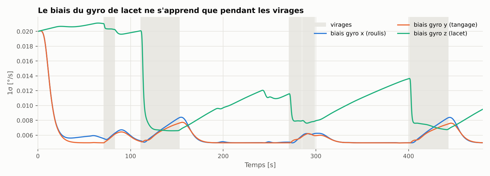

Le biais du gyro de lacet ne bouge pas avant les virages. Il passe de 0,020 à 0,007 °/s pendant les deux boucles, puis se dégrade à nouveau en ligne droite, sous l'effet de sa marche aléatoire.

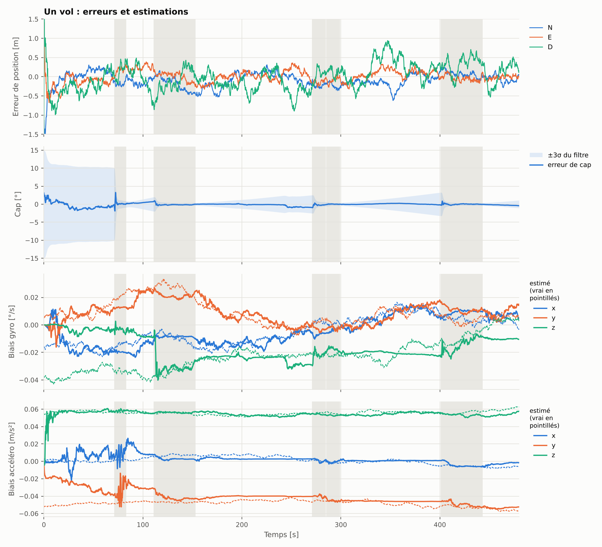

### Cohérence

<!-- source: docs/step3_results.md -->
| Bloc | NEES ou NIS moyen / ddl (attendu : 1) | Temps dans l'intervalle à 95 % |
|---|---|---|
| Position | 1,00 | 98 % |
| Vitesse | 1,00 | 94 % |
| Attitude | 1,01 | 86 % |
| Biais gyro | 1,02 | 87 % |
| Biais accéléro | 1,03 | 99 % |
| NIS GNSS | 1,00 | 95 % |

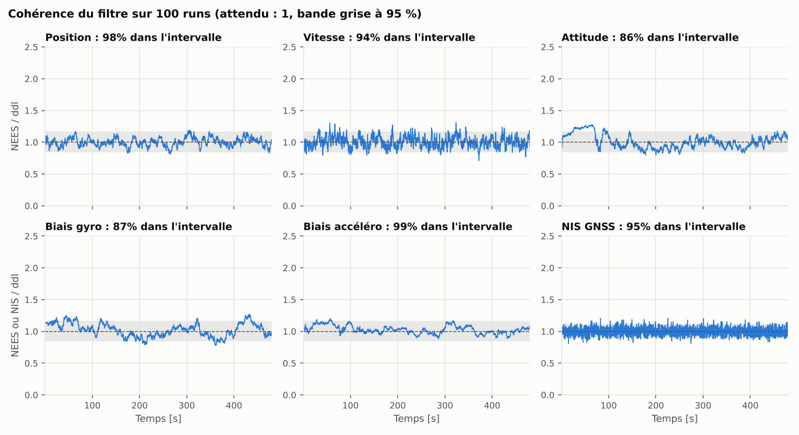

- **Position, vitesse et NIS** sont cohérents.
- **Biais :** leur moyenne est bonne, mais leur temps dans l'intervalle varie d'une graine à l'autre. Avec deux autres graines (avant la correction de l'étape 5), j'obtenais 91 et 92 % pour les biais gyro, 90 et 94 % pour les biais accéléro. Une erreur de biais évolue lentement, donc la moyenne sur 100 runs fait de longues excursions au lieu de fluctuer autour de 1. La fraction de temps hors de la bande est alors beaucoup plus dispersée que pour la position, qui se décorrèle en quelques secondes.
- **Attitude :** le défaut est réel et localisé. Il fait l'objet de la section suivante.

### Écarts rencontrés

Avant le premier virage, le NEES d'attitude valait 1,45 dans la première version : le filtre était trop sûr de lui. Après 100 s, il revenait à 1. Mon hypothèse était la linéarisation. Avec 5° d'erreur de cap, les termes du second ordre que l'EKF néglige (le produit de l'erreur de cap par l'erreur d'inclinaison dans `f × δθ`) sont du même ordre que ce que le filtre estime en ligne droite. Pour le vérifier, j'ai relancé le même vol en ne changeant que l'erreur de cap initiale :

<!-- source: docs/step3_results.md -->
| σ du cap initial | NEES d'attitude / ddl, de 5 s au premier virage | Après 100 s |
|---|---|---|
| 5° | 1,20 | 0,97 |
| 2° | 1,07 | 1,01 |
| 1° | 1,02 | 1,01 |

Ces chiffres sont ceux d'aujourd'hui. L'hypothèse n'expliquait qu'une partie de l'excès. À l'étape 5, les tests de mutation ont montré que la jacobienne de réinitialisation avait le mauvais signe depuis le début. J'avais pris `I − [δθ/2 ×]`, la formule d'une erreur d'attitude définie dans le repère avion. Ce filtre définit l'erreur dans le repère NED (`q_vrai = exp(δθ) ⊗ q`), et il faut alors `I + [δθ/2 ×]`. À chaque mise à jour, le mauvais signe faisait tourner la covariance d'attitude dans le mauvais sens et réduisait un peu trop l'incertitude du cap. Avec le bon signe, le NEES passe de 1,45 à 1,20 avec 5° d'erreur initiale. Le reste diminue toujours avec l'erreur initiale : c'est bien la linéarisation. Trois remèdes sont possibles :

- un meilleur cap initial (le magnétomètre de l'étape 5 le fait) ;
- gonfler la covariance d'attitude jusqu'au premier virage ;
- une mise à jour itérée ou sans parfum (UKF).

Un test compare maintenant la jacobienne de réinitialisation à la dérivée numérique de la composition exacte des rotations, calculée avec scipy. L'histoire complète du bug est dans la section « Vérification ».

Le script `step3_eskf.py` refait cette comparaison à chaque exécution.

## Étape 4 : GNSS réaliste, erreurs corrélées et latence

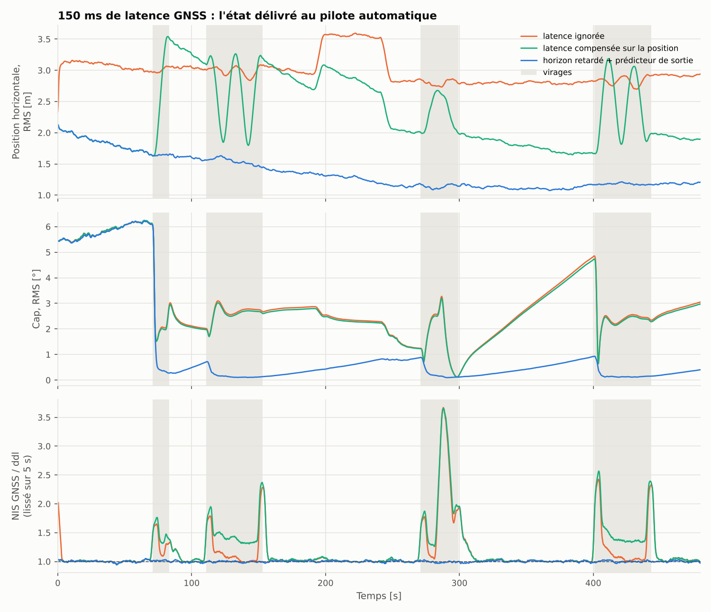

Le GNSS de l'étape 3 avait des erreurs blanches et aucune latence, deux hypothèses qu'aucun récepteur ne respecte. Ici, l'erreur totale de position reste la même (1,5 m à l'horizontale, 3 m en vertical), mais elle est découpée autrement :

- un bruit blanc de 0,5 m / 1 m ;
- une erreur de Gauss-Markov du premier ordre de 1,4 m / 2,8 m, corrélée sur 60 s (atmosphère, trajets multiples) ;
- une vitesse Doppler qui reste blanche ;
- une latence de 150 ms : la mesure décrit l'état à `t` mais arrive au filtre à `t + 150 ms`.

Toutes les configurations tournent sur la même mission, avec 50 runs et la même graine. Les erreurs sont celles de l'état délivré en temps réel, celui qu'utiliserait le pilote automatique, et sont mesurées après 120 s.

### Erreurs corrélées

<!-- source: docs/step4_results.md -->
| | Position horiz. | NEES position | NIS GNSS |
|---|---|---|---|
| A : erreurs blanches (étape 3) | 0,24 m | 1,02 | 1,00 |
| B : erreurs corrélées, traitées comme blanches | 1,78 m | 53 | 0,65 |
| C : erreurs corrélées, estimées par 3 états de plus | 1,18 m | 0,93 | 1,00 |

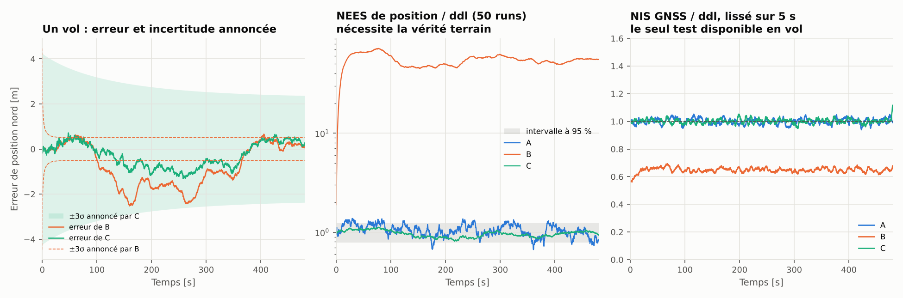

**B.** Le filtre traite une erreur qui dure une minute comme si elle changeait à chaque mesure. Il croit donc pouvoir la moyenner et annonce ±0,5 m (3σ), alors qu'il suit l'erreur du récepteur jusqu'à 2,5 m. C'est la même situation que la dérive du baro de l'étape 1.

Le NIS, seul test disponible en vol, dit même le contraire de la réalité : il vaut 0,65, donc le filtre a l'air trop prudent. La raison est que deux mesures successives portent presque la même erreur. L'innovation ne voit plus que la partie blanche (0,5 m), alors que le filtre attend 1,5 m.

**C.** Trois états de biais GNSS (Gauss-Markov, τ = 60 s) passent le filtre à 18 états. À l'initialisation sur le premier point, l'erreur de position vaut `−(b + n)` et l'erreur de biais vaut `b`, d'où un terme croisé négatif dans `P0`, exactement comme pour le baro de l'étape 1. Le filtre redevient cohérent, et l'erreur baisse d'un tiers (1,18 m contre 1,78 m). La vitesse Doppler n'est pas biaisée : intégrée, elle donne une position relative fiable qui permet de séparer une partie du biais de la vraie position.

### Latence de 150 ms

<!-- source: docs/step4_results.md -->
| | Position horiz. | Cap | NEES attitude | NIS GNSS |
|---|---|---|---|---|
| latence ignorée | 2,97 m | 2,63° | 61 | 1,18 |
| latence compensée sur la position (`z += v · 150 ms`) | 2,34 m | 2,56° | 58 | 1,25 |
| horizon retardé + prédicteur de sortie | 1,23 m | 0,46° | 1,02 | 1,00 |

**Latence ignorée.** En ligne droite, le filtre place l'avion là où il était 150 ms plus tôt, soit 2,5 m de retard à 17 m/s (3,3 m pendant la pointe à 22 m/s, bien visible sur la figure). En virage, c'est pire, parce que la mesure se trompe aussi de direction de vitesse. À 19 °/s de taux de virage, 150 ms font 2,9° : un écart latéral de 0,86 m/s que le filtre ne peut expliquer que par une erreur d'attitude ou de biais gyro. Le cap et le biais du gyro de lacet sont faussés à chaque virage, puis le cap dérive à chaque ligne droite (la rampe entre 300 et 400 s). Le NEES d'attitude monte à 61.

**Compensation de la position.** Avancer la position mesurée de `v · 150 ms` corrige le retard en ligne droite. La vitesse mesurée reste en retard en virage, donc l'attitude reste fausse et l'erreur de position revient dès le premier virage.

**Horizon retardé.** Le filtre tourne 150 ms dans le passé. Chaque mesure GNSS y arrive exactement à sa date, et le filtre lui-même est celui de C. L'état présent est obtenu en réintégrant les 30 derniers échantillons IMU gardés en mémoire (le prédicteur de sortie), sans covariance. C'est le principe de l'EKF2 de PX4. Toutes les erreurs reviennent au niveau de C (1,23 m contre 1,18 m), et la cohérence aussi.

Le NIS de la latence ignorée ne vaut que 1,18 en moyenne. En ligne droite, il reste à 1 : le filtre absorbe le retard en décalant son état, et rien ne le signale. Il ne monte qu'en virage (jusqu'à 3,7 pendant les virages en S). Un NIS qui ne grimpe qu'en virage est la signature à chercher dans des logs réels.

Le code est dans `src/navsim/fusion.py` (les trois stratégies), `src/navsim/eskf.py` (états de biais GNSS) et `src/navsim/gnss.py`.

### Écarts rencontrés

La généralisation du filtre (15 ou 18 états, matrice `H` explicite, boucle avec file d'échantillons IMU) touchait du code dont dépend l'étape 3. J'ai relancé l'étape 3 et comparé son tableau de résultats avec l'ancien, en ignorant la section provenance : aucun chiffre n'a changé. Un test vérifie aussi que le mode « horizon retardé » sans latence donne exactement le même filtre que le mode normal.

## Étape 5 : magnétomètre, baromètre, Pitot et vent

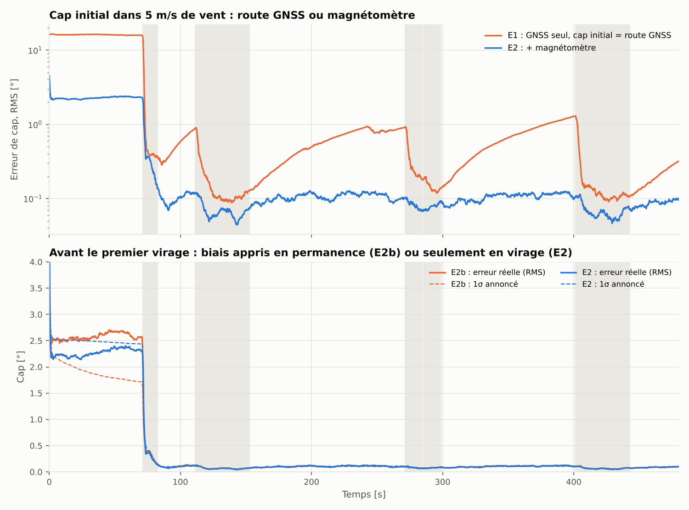

Jusqu'ici, l'avion volait sans vent et son cap initial venait de la route GNSS. Les deux vont ensemble : sans vent, le cap et la route sont confondus. La mission est maintenant la même que celle des étapes 2 à 4, mais dans un vent d'ouest de 5 m/s qui tourne au nord-ouest (6 m/s) entre 300 et 360 s. À 17 m/s de vitesse air, le nez de l'avion fait 16,4° avec sa route au départ.

Trois capteurs s'ajoutent, et avec eux six états. Le filtre passe de 18 à 24 états.

| Capteur | Fréquence | Erreurs simulées | États ajoutés |
|---|---|---|---|
| Magnétomètre 3 axes | 50 Hz | bruit de 3 mG, biais résiduel après calibration (hard-iron) de 10 mG par axe qui dérive lentement | biais, 3 états |
| Baromètre | 10 Hz | celui de l'étape 1 : bruit de 0,4 m, dérive de Gauss-Markov de 1,5 m sur 120 s | dérive, 1 état |
| Tube de Pitot | 10 Hz | vitesse air vraie, bruit de 0,3 m/s | vent nord et est, 2 états (marche aléatoire de 0,1 m/s/√s) |

Le champ magnétique est celui du sud de la France (0,47 G, inclinaison 61°, déclinaison 1,5°). La vérité terrain inclut le vent dans la vitesse sol et ses variations dans la force spécifique, sinon l'IMU ne sentirait pas une rafale que le GNSS voit. Un test vérifie que, dans un vent constant, l'attitude, les vitesses angulaires et la force spécifique restent celles du vol sans vent, et que seule la position glisse de `w·t`.

Toutes les configurations utilisent le filtre de l'étape 4 (GNSS réaliste, biais GNSS estimé, horizon retardé), avec 40 runs et exactement les mêmes tirages IMU et GNSS. Les erreurs « avant » sont mesurées entre 5 s et le premier virage (71 s), les autres après 120 s.

### Cap, magnétomètre, baromètre

<!-- source: docs/step5_results.md -->
| | Cap avant 1er virage | Cap après 120 s | NEES attitude avant | Position vert. |
|---|---|---|---|---|
| E1 : GNSS seul, cap initial = route GNSS | 16,11° | 0,56° | 4,72 | 1,64 m |
| E2 : + magnétomètre | 2,28° | 0,10° | 0,97 | 1,64 m |
| E2b : magnétomètre, biais appris en permanence | 2,58° | 0,10° | 1,43 | 1,64 m |
| E3 : + baromètre | 2,28° | 0,10° | 0,96 | 1,02 m |

**E1.** La route GNSS donne un cap faux de toute la dérive due au vent. Le filtre ne s'en rend compte qu'au premier virage : en ligne droite, le cap n'est pas observable avec le GNSS seul (étape 3). Pendant 70 s, il annonce donc un cap à quelques degrés près alors qu'il se trompe de 16°, d'où le NEES de 4,7. Ensuite, le cap redérive entre chaque virage, jusqu'à plus de 1°.

**E2.** Le cap initial vient du magnétomètre : le champ mesuré est remis à plat avec le roulis et le tangage estimés, puis on lit l'angle de sa partie horizontale et on ajoute la déclinaison. L'erreur tombe à 2,3°, et le filtre l'annonce correctement. Le magnétomètre est ensuite fusionné sur ses trois axes. Après le premier virage, le cap reste à 0,1°, même en ligne droite.

**E2b, le biais du magnétomètre.** Ma première version apprenait le biais du magnétomètre en permanence. Avant le premier virage, le filtre annonçait alors 1,7° de cap (1σ) pour une erreur réelle de 2,6°, et il se croyait encore plus sûr du biais :

<!-- source: docs/step5_results.md -->
| Avant le premier virage | NEES attitude | NEES biais magnéto |
|---|---|---|
| E2b : biais appris en permanence | 1,43 | 2,87 |
| E2 : biais appris seulement en virage | 0,97 | 1,02 |

En ligne droite, un biais constant et une erreur de cap produisent la même signature sur le champ mesuré : la combinaison n'est pas observable. Le filtre la croit pourtant observable, parce qu'il linéarise autour de sa propre estimation, qui bouge un peu à chaque échantillon. J'ai vérifié qu'une propagation de covariance autour de l'état vrai, elle, ne gagne rien. C'est un défaut connu de l'EKF, et c'est là qu'il apparaît sur un vrai drone qui décolle et part en ligne droite.

La correction : le biais n'est appris que lorsque l'avion tourne à plus de 5 °/s. Le reste du temps, ses trois états deviennent des états « consider » (Schmidt-Kalman) : leur incertitude entre dans l'innovation, mais le filtre ne les corrige pas. Les deux NEES reviennent à 1. Un test garde les deux comportements, et une mutation qui inverse la condition est détectée.

C'est aussi ce cas qui a fait apparaître le bug de signe de la jacobienne de réinitialisation, présent depuis l'étape 3. Avant sa correction, le NEES d'attitude de E2b montait à 2,9 au lieu de 1,4 : l'erreur de signe amplifiait la fausse observabilité. L'histoire est dans [`docs/verification.md`](docs/verification.md#m05--la-mutation-qui-avait-raison).

**E3.** Le baromètre ramène l'erreur verticale de 1,64 m à 1,02 m. Sa dérive est estimée par un état, comme à l'étape 1. L'altitude GNSS, avec ses 2,8 m d'erreur corrélée, ne sert plus qu'à caler cette dérive.

### Pitot et vent

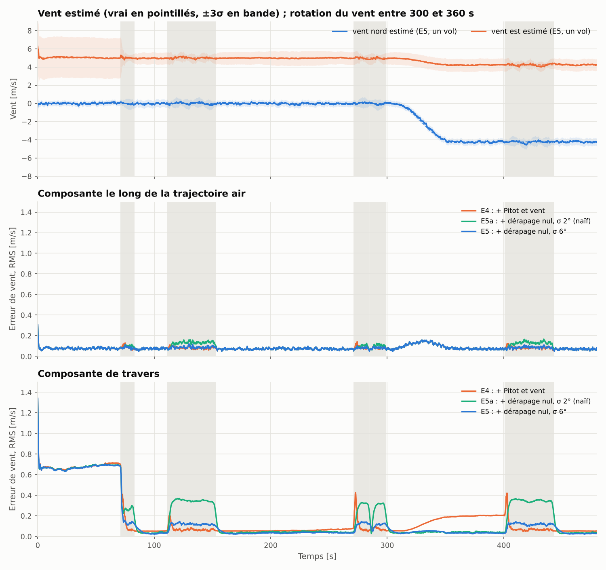

<!-- source: docs/step5_results.md -->
| | Cap avant 1er virage | Vent de travers avant 1er virage | Vent le long | Vent de travers | NEES vent |
|---|---|---|---|---|---|
| E4 : + Pitot et vent | 2,25° | 0,69 m/s | 0,08 m/s | 0,11 m/s | 0,36 |
| E5a : + dérapage nul, σ 2° (naïf) | 2,26° | 0,67 m/s | 0,10 m/s | 0,18 m/s | 1,18 |
| E5i : σ 6°, vent initial nul | 3,12° | 0,93 m/s | 0,08 m/s | 0,07 m/s | 0,41 |
| E5 : + dérapage nul, σ 6° | 2,26° | 0,67 m/s | 0,08 m/s | 0,07 m/s | 0,41 |

Les erreurs de vent sont projetées sur la trajectoire air : « le long » dans l'axe de vol, « de travers » perpendiculairement.

**E4.** Le Pitot mesure `|v − w|`. Il ne voit donc que la composante du vent dans l'axe de vol. Le vent de travers ne devient observable que quand l'avion tourne et que cet axe change de direction : sur la figure, l'erreur de travers tombe au premier virage. Comme dans l'EKF2 de PX4, le vent démarre sur le premier échantillon Pitot : vitesse GNSS moins vitesse air portée par le cap. Sa covariance initiale est corrélée au cap, parce qu'une erreur de cap de 2,3° à 17 m/s donne 0,68 m/s d'erreur sur le vent de travers. C'est bien ce qu'on mesure avant le premier virage.

Après 120 s, le vent est connu à 0,1 m/s près. Le NEES de 0,36 montre un filtre prudent. La marche aléatoire du vent est dimensionnée pour suivre sa rotation entre 300 et 360 s, et le reste du temps le vent est constant. En ligne droite après cette rotation, l'erreur de travers remonte à 0,2 m/s : rien ne l'observe en dehors des virages.

**E5, le dérapage nul.** Un avion à voilure fixe vole avec sa vitesse air dans son plan de symétrie. Le dérapage est donc proche de zéro, et cette information se fusionne comme une mesure synthétique. Elle relie le vent de travers au cap, et le magnétomètre donne le cap : le vent de travers devient observable en ligne droite.

Dans ma vérité terrain, le dérapage vaut exactement zéro ailes à plat, mais il atteint 1,5° en virage (l'incidence de 3° tournée par le roulis), et il y reste plusieurs secondes. Avec σ = 2° fusionné à 10 Hz (E5a), c'est pire que sans la mesure : 0,18 m/s de travers contre 0,11, et un NEES de 1,18. Le filtre traite dix échantillons par seconde comme indépendants alors qu'ils portent la même erreur, et il pousse ce 1,5° dans le vent à chaque virage (les bosses à 0,35 m/s de la figure). Avec σ = 6°, soit 2° une fois par seconde, le vent de travers descend à 0,07 m/s et le filtre reste cohérent.

**E5i, le vent initial.** Ma première version démarrait avec un vent nul à ±5 m/s. Sans dérapage, cela ne gênait pas. Avec, la première innovation de dérapage vaut l'angle de dérive complet, environ 16°. L'EKF linéarise une erreur de cette taille et la répartit entre le cap et le vent : le cap avant le premier virage passe à 3,12°, avec un NEES d'attitude de 1,39 (0,99 pour E5). Dans un essai rapide sur 8 runs, démarrer le même filtre avec le vent vrai réduisait l'écart de moitié, ce qui confirmait la cause. L'initialisation sur le premier échantillon Pitot le supprime. Un test compare la covariance initiale du vent, termes croisés compris, à 40 000 tirages de la relation non linéaire.

**La position horizontale** reste à 1,27 m dans toutes les configurations. Aucun de ces capteurs ne mesure la position, et c'est l'erreur corrélée du GNSS qui domine. Leur intérêt pour la position apparaîtra quand le GNSS disparaît (étape 6) : avec le cap magnétique, la vitesse air et le vent, le filtre peut naviguer à l'estime au lieu de dériver en inertiel pur.

Le code est dans `src/navsim/aiding.py` (capteurs), `src/navsim/eskf.py` (`update_baro`, `update_mag`, `update_airspeed`, `update_sideslip`) et `src/navsim/fusion.py` (initialisation du vent, apprentissage du biais en virage).

### Écarts rencontrés

- **La jacobienne du dérapage.** Ma première version oubliait la dérivée de `1/V`. Une comparaison à la dérivée numérique l'a montré. Les quatre jacobiennes de mesure sont maintenant testées contre des fonctions de mesure réécrites avec scipy, et la mutation M28 remet l'erreur pour vérifier que les tests la trouvent.
- **Comparer à tirages égaux.** Les nouveaux capteurs tiraient leur bruit dans le même générateur aléatoire que l'IMU et le GNSS. Ajouter un capteur changeait donc les erreurs IMU et GNSS de tout le vol, et deux configurations ne différaient plus seulement par le filtre. Chaque capteur d'aide a maintenant son propre générateur, dérivé de la graine. J'ai relancé les étapes 2 à 4 : aucun chiffre n'a changé.
- Le biais du magnétomètre et le vent initial sont décrits plus haut (E2b, E5i).

## Étape 6 : modes dégradés

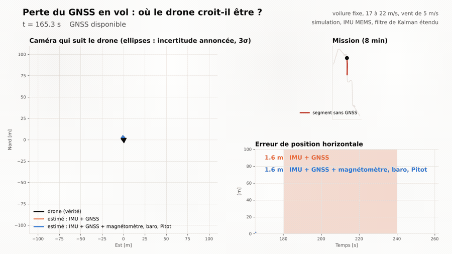

Un capteur peut se taire ou se tromper. Cette étape injecte quatre pannes dans les mesures simulées de la mission de l'étape 5, sans prévenir le filtre :

- une perte du GNSS pendant 60 s ;
- un saut de 15 m de la position GNSS pendant 30 s, comme avec des trajets multiples ;
- une perturbation magnétique locale, par exemple une ligne électrique ou un courant moteur ;
- un vent qui tourne.

Le filtre a deux défenses.

- **Le test d'innovation.** Avant chaque mise à jour, le NIS de la mesure est comparé au seuil du χ² à 99,9 %. Au-delà, la mesure est rejetée pour ce run. Un filtre cohérent rejette ainsi 0,1 % de mesures valides.
- **Deux protections contre le blocage.** Si aucune position GNSS n'a été acceptée depuis 45 s, la suivante est imposée : position et vitesse repartent sur elle. Si le Pitot est rejeté 5 s de suite, le vent est réinitialisé sur la mesure courante, comme au démarrage.

Chaque configuration tourne avec 40 runs et les mêmes tirages. La vidéo complète est dans [`docs/img/step6_outage.mp4`](docs/img/step6_outage.mp4).

### Perte du GNSS pendant 60 s

<!-- source: docs/step6_results.md -->
| De 180 à 240 s, en ligne droite | Après 30 s | Après 60 s | Pire run après 60 s | NEES position |
|---|---|---|---|---|
| O1 : IMU + GNSS | 14,8 m | 85,1 m | 140,7 m | 1,18 |
| O2 : + magnétomètre et baro | 8,1 m | 39,3 m | 135,4 m | 1,07 |
| O3 : + Pitot et vent (étape 5) | 5,8 m | 14,8 m | 35,5 m | 0,74 |
| O4 : + vent quasi figé sans GNSS | 3,8 m | 6,9 m | 16,9 m | 0,68 |

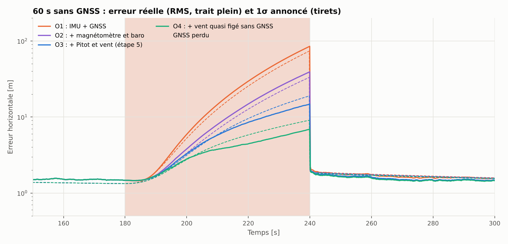

En inertiel pur (O1), l'erreur de cap et le biais de l'accéléromètre sont intégrés deux fois, et l'erreur croît avec le carré du temps : 85 m après une minute. Le magnétomètre (O2) tient le cap, mais pas le biais de l'accéléromètre. Avec le Pitot (O3), la vitesse sol vient de la vitesse air et du vent estimé avant la perte. L'erreur croît alors à peu près linéairement, au rythme de l'erreur sur le vent : 14,8 m après 60 s. Dans les quatre cas, l'incertitude annoncée suit l'erreur réelle (NEES entre 0,7 et 1,2), et le GNSS est accepté dès son retour.

O4 va plus loin. Sans GNSS, le vent n'est plus observable, et sa marche aléatoire de 0,1 m/s/√s ne sert plus qu'à laisser le filtre expliquer sa propre dérive par un changement de vent. O4 la réduit à 0,01 tant qu'aucune position GNSS n'a été acceptée depuis 1 s, et l'erreur est divisée par deux. La section suivante montre ce que ça coûte.

### Saut GNSS de 15 m

<!-- source: docs/step6_results.md -->
| De 320 à 350 s, pendant que le vent tourne | Erreur max pendant | NEES pendant | Erreur max après | GNSS rejeté pendant |
|---|---|---|---|---|
| J1 : sans test d'innovation | 4,4 m | 7,5 | 3,9 m | 0,0 % |
| J2 : avec test, vent de l'étape 5 | 7,7 m | 1,2 | 3,8 m | 99,9 % |
| J3 : avec test, vent quasi figé sans GNSS, sans réinitialisation | 43,5 m | 40,1 | 413,8 m | 100,0 % |
| J4 : comme J3, réinitialisation sur le GNSS après 45 s | 43,5 m | 40,1 | 84,5 m | 100,0 % |
| J5 : comme J2, réinitialisation après 10 s | 15,3 m | 49,3 | 15,2 m | 33,4 % |

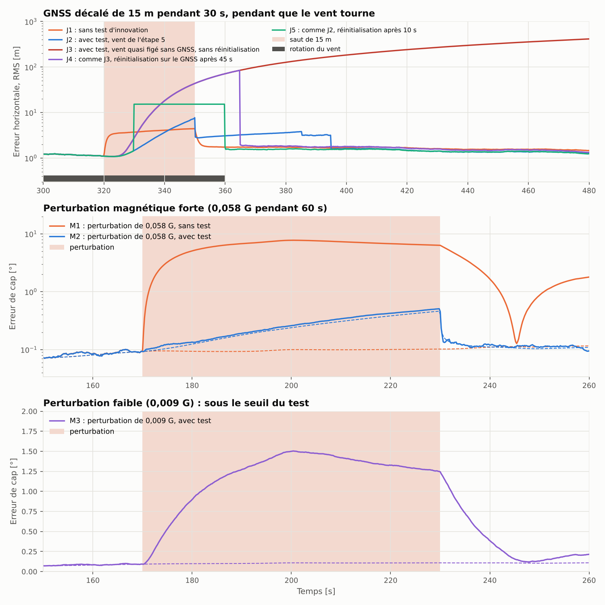

**J1.** Sans test, le filtre suit le saut en partie. Les états de biais GNSS de l'étape 4 en absorbent la plus grande part, d'où seulement 4,4 m d'erreur, mais le filtre se croit précis à 1 m (NEES de 7,5).

**J2.** Le test rejette toutes les positions décalées, et le filtre navigue à l'estime pendant 30 s, comme dans la perte GNSS. L'erreur monte à 7,7 m, mais le filtre l'annonce.

**J3.** C'est le défaut d'O4. Le saut arrive pendant la rotation du vent. Avec le vent quasi figé, le filtre attribue l'écart au Pitot à sa vitesse au lieu du vent, et sa navigation à l'estime dérive. Il reste pourtant sûr de lui. Quand le GNSS redevient correct à 350 s, l'écart est trop grand pour le test, et le GNSS est rejeté jusqu'à la fin du vol : 414 m d'erreur à l'atterrissage. Un test d'innovation sur un filtre trop confiant ne protège plus, il enferme le filtre dans son erreur.

**J4 et J5.** La réinitialisation sur le GNSS sort le filtre de ce blocage, et son délai est un compromis. À 45 s (J4), le filtre récupère, mais après avoir atteint 84 m. À 10 s (J5), il accepte le saut au bout de 10 s et garde 15 m d'erreur jusqu'à sa fin. Avec un seul GNSS, rien ne distingue un GNSS qui saute d'une navigation à l'estime qui dérive. Le délai fixe la durée pendant laquelle on fait confiance à la navigation à l'estime. J'ai pris 45 s, d'après O3 (15 m après 60 s).

Je garde donc le modèle de vent de l'étape 5 (O3, J2) et pas l'astuce d'O4. Elle gagne 8 m sur une perte GNSS isolée, mais elle rend le filtre trop confiant dès que le vent change pendant la panne.

### Perturbation magnétique

<!-- source: docs/step6_results.md -->
| De 170 à 230 s, en ligne droite | Erreur de cap max | NEES attitude | Magnétomètre rejeté pendant |
|---|---|---|---|
| M1 : perturbation de 0,058 G, sans test | 7,75° | 9982 | 0,0 % |
| M2 : perturbation de 0,058 G, avec test | 0,51° | 1,1 | 100,0 % |
| M3 : perturbation de 0,009 G, avec test | 1,50° | 289 | 1,6 % |

Une perturbation de 0,058 G (12 % du champ terrestre) fausse le cap de 7,75° sans test (M1). Avec le test (M2), elle est rejetée en entier. Le cap dérive alors lentement sur le gyroscope, jusqu'à 0,5°, et le filtre l'annonce.

Une perturbation de 0,009 G (2 % du champ, M3) passe sous le seuil : 1,6 % des mesures seulement sont rejetées. Le cap se décale de 1,5° alors que le filtre annonce 0,1°. Le test ne voit que ce qui est grand devant le bruit. Pour un biais petit et durable, il faudrait un autre détecteur : la norme et l'inclinaison du champ mesuré, ou la comparaison avec le cap déduit du GNSS en virage.

### Vent et blocage du Pitot

<!-- source: docs/step6_results.md -->
| Rotation du vent de 300 à 360 s, sans panne | Erreur de vent max | NEES vent | Erreur de vent après 400 s | Pitot rejeté |
|---|---|---|---|---|
| O3 : marche aléatoire 0,1 (étape 5) | 0,17 m/s | 0,6 | 0,12 m/s | 0,1 % |
| W1 : marche aléatoire 0,01, sans protection | 3,43 m/s | 845 | 1,86 m/s | 73,0 % |
| W2 : marche aléatoire 0,01, avec protection | 1,83 m/s | 168 | 0,04 m/s | 10,0 % |

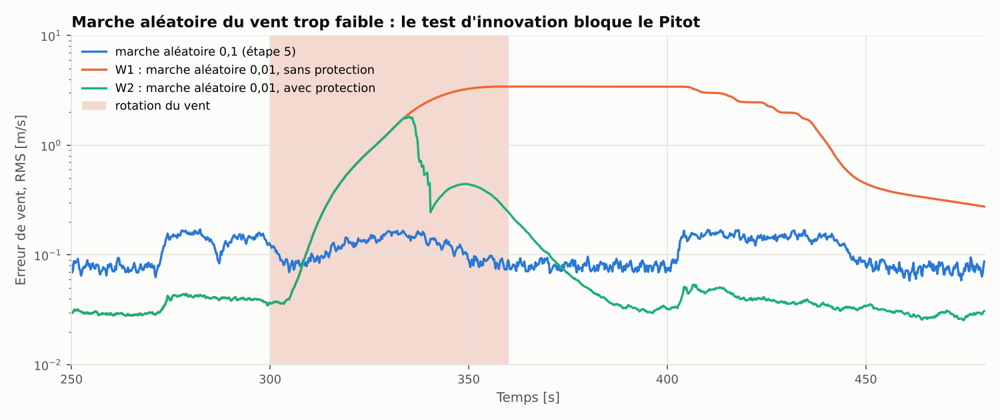

Si une marche aléatoire faible améliore la navigation à l'estime, pourquoi ne pas la garder tout le temps ? Avec 0,01 m/s/√s (W1), le vent estimé ne suit plus la rotation. Les innovations du Pitot dépassent le seuil et sont rejetées, et le vent ne peut plus être corrigé : il reste faux de 1,9 m/s jusqu'à la fin du vol. C'est le même blocage que J3, sur un autre capteur. La protection (W2) réinitialise le vent après 5 s de rejet. Le filtre récupère, mais il reste trop confiant pendant toute la rotation (NEES de 168). La marche aléatoire de 0,1 de l'étape 5 est la seule des trois qui reste cohérente.

Le code est dans `src/navsim/faults.py` (pannes), `src/navsim/eskf.py` (test d'innovation, réinitialisation sur le GNSS) et `src/navsim/fusion.py` (protections, marche aléatoire sans GNSS).

### Écarts rencontrés

- **Une panne à la fois ne suffit pas.** O4 était la meilleure configuration sur la perte GNSS seule. Son défaut n'est apparu qu'avec un saut GNSS tombé pendant la rotation du vent, que j'avais placé là sans y penser.
- **La réinitialisation du vent faisait planter le filtre.** La covariance initiale du vent de l'étape 5 supposait un dérapage exactement nul. Le vent de travers y était alors une combinaison exacte des erreurs de vitesse et de cap, et `P` devenait singulière. Le démarrage passait de justesse, la réinitialisation en vol non. J'ai ajouté une incertitude de 2° sur le dérapage, ce qui change les résultats de l'étape 5 d'au plus 0,02° de cap.
- **Le premier test du blocage GNSS ne le reproduisait pas.** J'avais mis un changement de vent rapide (4 m/s en 10 s). L'IMU le sent, le Pitot est rejeté, et la navigation à l'estime reste bonne. Le blocage n'apparaît qu'avec un changement lent : le Pitot reste accepté et tire la vitesse vers une valeur fausse. Le test utilise maintenant une rotation sur 60 s, comme la mission.

Les vibrations, prévues au départ dans cette étape, ne sont pas encore simulées.

## Étape 7 : rejeu de vrais logs PX4

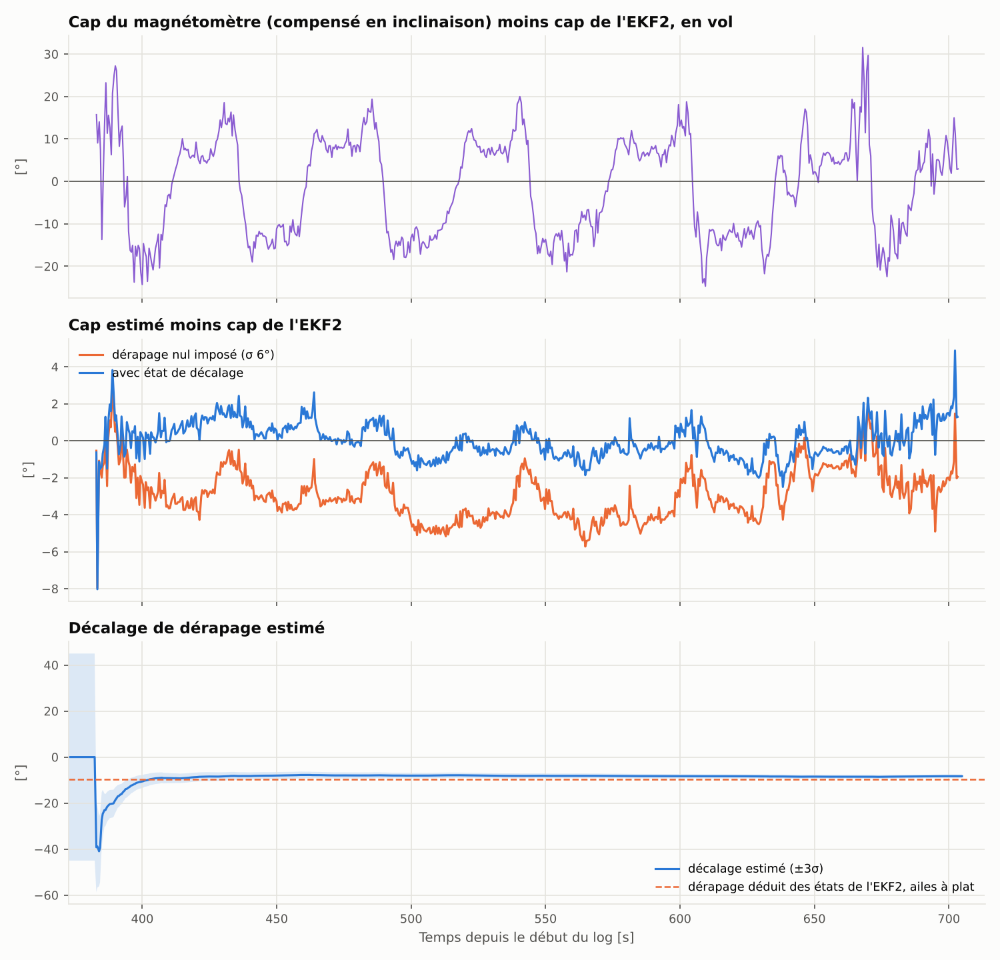

Jusqu'ici, tout venait du simulateur. Cette étape fait tourner le même filtre sur trois vols réels, des logs publics de [review.px4.io](https://review.px4.io) que le dépôt ne contient pas : le script donne les liens de téléchargement et vérifie leur empreinte SHA-256.

<!-- source: docs/step7_results.md -->
| Vol | Log | Matériel | Durée | En vol | GNSS loggé | Magnéto loggé | Vitesse air loggée |
|---|---|---|---|---|---|---|---|
| A1 | `7ce4abb5` | PX4_FMU_V6X | 705 s | 321 s | 2,0 Hz | 2,0 Hz | 5,0 Hz |
| A2 | `178e9452` | PX4_FMU_V6X | 636 s | 417 s | 2,0 Hz | 2,0 Hz | 5,0 Hz |
| B | `e163c6fb` | PX4_FMU_V6C | 593 s | 583 s | 7,5 Hz | 2,0 Hz | 5,0 Hz |

A1 et A2 viennent du même avion. `src/navsim/ulog_reader.py` lit le log avec pyulog et en tire :

- les incréments IMU, sur leurs vrais intervalles d'intégration ;
- les positions GNSS avec la précision annoncée par le récepteur ;
- le baromètre, le magnétomètre déjà calibré par PX4 et la vitesse air ;
- les sorties de l'EKF2 embarqué, qui servent de référence.

Chaque mesure est datée de son instant de validité, en retirant le retard que l'EKF2 utilisait dans ce vol (`EKF2_GPS_DELAY`, `EKF2_ASP_DELAY`...). Les positions sont projetées comme le fait PX4, autour de l'origine de l'EKF2, pour que les deux filtres travaillent dans le même repère. Le champ magnétique de référence vient du modèle mondial WMM à la date et au lieu du vol.

`src/navsim/replay.py` fait tourner le filtre sur ces données. Par rapport à la boucle de simulation, il gère des intervalles IMU irréguliers et une covariance GNSS qui change à chaque mesure. Il ne fusionne la vitesse air et le dérapage qu'au-dessus de 8 m/s, et ne démarre le vent qu'à ce moment-là. Les bruits sont ceux que l'EKF2 utilisait dans le vol, convertis en densités : l'EKF2 les exprime par pas de prédiction de 10 ms.

Un vrai vol n'a pas de vérité terrain. J'ai donc trois façons de juger le filtre : l'écart à l'EKF2, la cohérence des innovations (NIS), et des pertes GNSS simulées sur le vol réel, où la position GNSS qui suit la perte sert de référence.

### Ce que les logs disent de leurs capteurs

Avant de rejouer quoi que ce soit, les états de l'EKF2 permettent de vérifier les hypothèses des étapes 5 et 6 :

<!-- source: docs/step7_results.md -->
| Vol | Champ mesuré | Champ WMM | Inclinaison mesurée | Inclinaison WMM | Cap magnéto − cap EKF2, écart-type | Dérapage ailes à plat | Vitesse air / \|v − w\| |
|---|---|---|---|---|---|---|---|
| A1 | 0,401 G | 0,485 G | 58,8° | 64,6° | 11,4° | −9,6° | 0,983 |
| A2 | 0,399 G | 0,485 G | 58,7° | 64,6° | 9,0° | −7,1° | 1,000 |
| B | 0,440 G | 0,448 G | 35,9° | 34,2° | 3,9° | 5,0° | 1,364 |

**Magnétomètre.** Sur l'avion A, le champ mesuré est 17 % plus faible que celui du modèle et incliné de 6° de moins. Le cap qu'on en tire s'écarte de celui de l'EKF2 de ±10°, et cet écart dépend du cap : il fait des créneaux au rythme des orbites (figure du haut). L'étape 5 supposait un bruit blanc de 3 mG, l'équivalent de moins d'un degré de cap. J'ai ajouté une fusion du cap seul (`MagConfig(fusion="heading")`) : elle n'utilise que la déclinaison, pas l'intensité ni l'inclinaison, et prend l'écart-type de cap de l'EKF2 (17°).

**Dérapage.** Les états de l'EKF2 eux-mêmes donnent un dérapage de −7 à −10° ailes à plat sur l'avion A. Soit l'autopilote est monté tourné par rapport à l'axe de l'avion, soit l'avion vole vraiment en crabe. Dans les deux cas, l'hypothèse « dérapage nul dans le repère de l'IMU » de l'étape 5 est fausse sur cet avion.

**Vitesse air.** Sur l'avion B, la vitesse air mesurée est 36 % plus grande que la vitesse par rapport à l'air déduite de l'EKF2. Dans ce vol, la fusion de la vitesse air était désactivée (`EKF2_ARSP_THR = 0`).

### Écart au filtre embarqué

<!-- source: docs/step7_results.md -->
| | A1 : position horiz. | A1 : cap, moyenne | A1 : vent | A2 : position horiz. | A2 : cap, moyenne | A2 : vent |
|---|---|---|---|---|---|---|
| R1 : IMU + GNSS | 0,45 m | 0,17° | – | 0,19 m | 0,42° | – |
| R2 : + baro, magnétomètre (cap) | 0,46 m | 0,13° | – | 0,19 m | 0,40° | – |
| R3 : + Pitot, vent, dérapage avec décalage | 0,44 m | −0,06° | 0,55 m/s | 0,19 m | 0,68° | 0,50 m/s |
| R3 sans état de décalage (dérapage σ 6°) | 0,48 m | −3,02° | 1,32 m/s | 0,20 m | −2,17° | 1,10 m/s |
| R3 sans décalage, dérapage σ 17° (valeur EKF2) | 0,45 m | −0,91° | 0,71 m/s | 0,18 m | −0,52° | 0,67 m/s |

En vol, les deux filtres restent à moins d'un demi-mètre l'un de l'autre, alors que le mien ne voit que les positions GNSS loggées, à 2 Hz. Le cap concorde à 0,7 à 1,1° RMS près.

Avec la mesure de dérapage nul de l'étape 5 (σ = 6°), le cap se décale de 2 à 3° par rapport à l'EKF2, et le vent de 1,1 à 1,3 m/s. L'EKF2 évite ce piège en donnant à cette mesure un écart-type de 17° (`EKF2_BETA_NOISE`), ce qui la rend presque inutile. J'ai préféré ajouter un état de décalage de dérapage : la mesure devient « dérapage − décalage = 0 », et le filtre estime le décalage en vol. Le cap est observable par ailleurs (GNSS en virage), donc le décalage l'est aussi.

<!-- source: docs/step7_results.md -->
| Vol | Décalage de dérapage estimé | ±1σ | Dérapage déduit de l'EKF2 | Échelle de vitesse air estimée | Rapport vitesse air / \|v − w\| de l'EKF2 |
|---|---|---|---|---|---|
| A1 | −8,3° | 0,3° | −9,6° | 0,992 | 0,983 |
| A2 | −6,6° | 0,2° | −7,1° | 1,000 | 1,000 |
| B | – | – | – | 1,352 | 1,364 |

Le décalage converge en une trentaine de secondes après le décollage (figure du haut, en bas), et le biais de cap disparaît. Sur le même principe, un état d'échelle de la vitesse air retrouve les 35 % d'erreur de l'avion B, sans rien savoir de l'EKF2.

Les NIS sont tous bas en vol : 0,1 à 0,3 pour le GNSS, 0,01 à 0,15 pour le baro (détail dans `docs/step7_results.md`). Les bruits de l'EKF2 sont prudents pour cet avion. J'ai essayé de les resserrer d'après ces NIS : les pertes GNSS ci-dessous se dégradent et le filtre devient trop sûr de lui. Comme à l'étape 4, un NIS bas peut venir d'erreurs corrélées autant que d'un excès de prudence.

### Pertes GNSS sur les vols réels

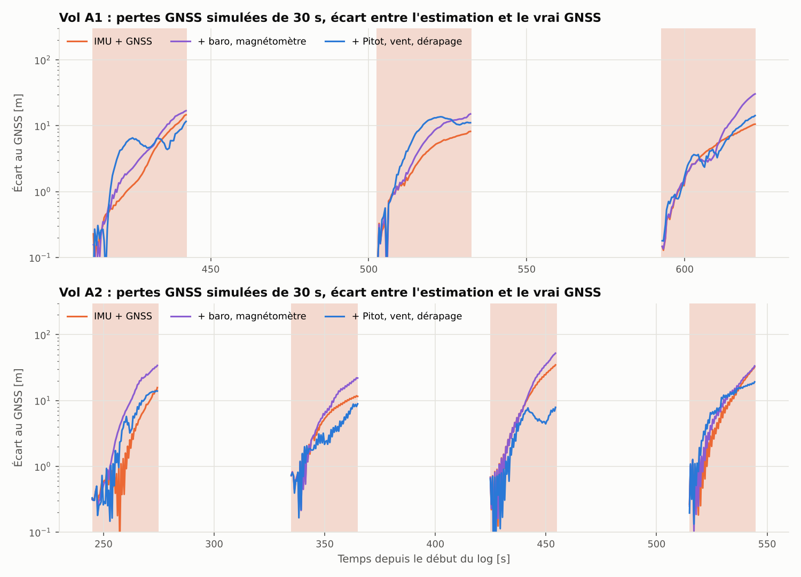

Le GNSS est coupé 30 s toutes les 90 s en vol, soit 7 pertes sur les deux vols de l'avion A. À la fin de chaque perte, l'estimation est comparée à la vraie position GNSS qui suit.

<!-- source: docs/step7_results.md -->
| | Écart médian | Médiane A1 / A2 | Écart max | 1σ annoncé médian | Écart / σ max |
|---|---|---|---|---|---|
| R1 : IMU + GNSS | 15,1 m | 10,8 / 24,5 m | 36,1 m | 49,6 m | 0,68 |
| R1 + baro | 23,8 m | 14,8 / 36,9 m | 54,5 m | 37,9 m | 1,35 |
| R2 : + baro, magnétomètre (cap) | 31,4 m | 17,8 / 35,1 m | 54,6 m | 37,4 m | 1,36 |
| R3 : + Pitot, vent, dérapage avec décalage | 12,0 m | 12,0 / 11,7 m | 19,1 m | 16,0 m | 1,19 |

Avec la vitesse air et le vent (R3), l'écart reste entre 7 et 19 m après 30 s, et l'incertitude annoncée le suit. L'IMU seule (R1) fait à peine moins bien en médiane, mais varie beaucoup plus d'une perte à l'autre (8 à 36 m) et annonce trois fois trop d'incertitude, à cause des bruits prudents de l'EKF2.

Le résultat inattendu, c'est R2 : ajouter le baromètre et le magnétomètre dégrade la navigation à l'estime, jusqu'à 55 m. En testant chaque capteur séparément, c'est déjà le cas du baromètre seul (R1 + baro). Je n'ai pas encore isolé le mécanisme. Mon hypothèse : une erreur de pression statique qui varie avec la vitesse et l'attitude passe dans l'inclinaison par la voie verticale. Sept pertes, c'est peu, et je n'en tire que les ordres de grandeur.

Le code est dans `src/navsim/ulog_reader.py` (lecture des logs), `src/navsim/replay.py` (rejeu, réglage depuis les paramètres EKF2, pertes simulées) et `src/navsim/eskf.py` (fusion du cap, états d'échelle de vitesse air et de décalage de dérapage, intervalles IMU irréguliers).

### Écarts rencontrés

- **La jacobienne de la mesure de cap.** Ma docstring affirmait qu'une erreur d'attitude ne change le cap que par sa composante verticale (H = [0, 0, 1]). La dérivée numérique a montré deux termes en tan(tangage) : une erreur d'inclinaison change aussi le lacet quand le nez est levé ou baissé. Un test vérifie maintenant la jacobienne à plusieurs tangages.
- **Les angles d'Euler sur le vol B.** La première comparaison donnait 37° d'écart de roulis RMS avec l'EKF2. Le vol B passe quatre minutes à un tangage de −80 à −90° selon l'EKF2, là où roulis et lacet ne sont plus définis. Les écarts d'attitude sont maintenant calculés comme une rotation (inclinaison et cap dans le repère NED), indépendante des angles d'Euler. Ce vol a un comportement que je ne comprends pas encore (configuration de l'autopilote, appareil hybride ?), donc je ne m'en sers que pour l'échelle de vitesse air.
- **La projection locale.** Ma première version projetait les positions GNSS sur un plan tangent à l'ellipsoïde WGS84. PX4 utilise une projection azimutale équidistante sur une sphère de 6 371 km. Le passage à la projection de PX4 a ramené l'écart horizontal à l'EKF2 de 0,55 à 0,45 m sur A1, et de 0,43 à 0,19 m sur A2.
- **Les horodatages.** Dans ces logs, `timestamp_sample` vaut zéro pour le GNSS. Le lecteur ne l'utilise que s'il est rempli.

## Étape 8 : portage C++

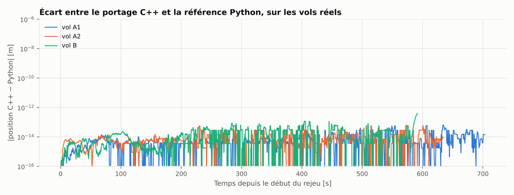

Le filtre tourne maintenant aussi en C++17 (`cpp/`). C'est la configuration rejouée sur les vrais vols à l'étape 7 (R3) : 20 états, avec la dérive baro, le vent, l'échelle de vitesse air, le décalage de dérapage et le cap magnétique.

- **Matrices de taille fixe.** Toutes les matrices sont des types Eigen dont la taille est connue à la compilation (`Matrix<double, 20, 20>`, `Matrix<double, 6, 20>`...). Le filtre ne fait aucune allocation dynamique une fois construit.
- **Vérification de l'absence d'allocation.** `cpp/tests/test_eskf.cpp` le vérifie de deux façons indépendantes : la garde d'Eigen (`EIGEN_RUNTIME_NO_MALLOC`), qui arrête le programme à la moindre allocation interne, et un `operator new` global qui compte chaque allocation pendant 8 000 prédictions et 200 mises à jour de chaque type.
- **Une boucle d'autopilote.** La lecture des fichiers alloue, le filtre non. `nav_replay` reçoit un flux d'événements (échantillon IMU, position GNSS, baro, magnétomètre, vitesse air) et les traite un par un.
- **Le même flux que Python.** Python décide de tout ce qui précède la première prédiction (instant de départ, données d'initialisation, ordre des mesures) avec la même fonction que le rejeu de l'étape 7 (`replay.setup`), et l'écrit pour le programme C++. Les deux versions voient donc exactement les mêmes entrées, dans le même ordre.

Chaque fonction C++ suit sa version Python ligne à ligne, et le commentaire de tête la nomme : prédiction et matrice de transition, forme de Joseph, réinitialisation, mesures, initialisation du vent, protections contre le blocage.

<!-- source: docs/step8_results.md -->
| Vol | Rejeu | Écart de position max | Écart d'attitude max | Décisions du test différentes | Python | C++ (filtre seul) | C++ par événement |
|---|---|---|---|---|---|---|---|
| A1 | vol complet | 5,7·10⁻¹⁴ m | 5,6·10⁻¹⁵ rad | 0 sur 9516 | 55,7 s | 0,59 s | 3,91 µs |
| A2 | vol complet | 5,7·10⁻¹⁴ m | 3,3·10⁻¹⁵ rad | 0 sur 9828 | 47,9 s | 0,53 s | 3,91 µs |
| B | vol complet | 3,7·10⁻¹³ m | 1,1·10⁻¹⁴ rad | 0 sur 11782 | 45,4 s | 0,55 s | 4,16 µs |
| B | pertes GNSS de 30 s | 9,2·10⁻¹² m | 1,3·10⁻¹⁴ rad | 0 sur 10382 | 46,1 s | 0,52 s | 3,96 µs |

Sur les trois vols réels, les deux versions donnent les mêmes états à l'arrondi près : 10⁻¹⁴ à 10⁻¹¹ m en position, 10⁻¹⁴ rad en attitude, sur dix minutes de vol et 130 000 à 150 000 événements. Elles prennent aussi les mêmes décisions à chaque test d'innovation. Les écarts qui restent viennent de l'ordre des additions dans les produits de matrices (NumPy et Eigen ne somment pas dans le même ordre). Ils restent au niveau de l'arrondi d'une position de quelques centaines de mètres et ne grossissent pas avec le temps, sauf à la toute fin du vol B, pendant l'impact.

Le C++ traite un vol de dix minutes en un peu plus d'une demi-seconde, 70 à 80 fois plus vite que Python, soit environ 4 µs par événement sur un PC de bureau. Une prédiction prend 3,4 µs et une mise à jour GNSS 9,5 µs. Le budget d'un autopilote à 200 Hz est de 5 ms par échantillon, avec un processeur bien plus lent. Le code n'a pas encore tourné sur une carte embarquée.

`tests/test_step8.py` compile le C++ dans un dossier neuf et compare les deux versions sur des vols simulés qui passent par toutes les branches de la boucle : perte GNSS, rejets, remise sur le GNSS, réinitialisation du vent après un Pitot faux de 30 %. Sur un vol simulé de 240 s, l'écart était de 3·10⁻¹² m. La CI compile le C++ avec tous les avertissements traités comme des erreurs (`-Wall -Wextra -Wpedantic -Wshadow -Wconversion -Werror`) et lance ses tests unitaires.

Le code est dans `cpp/include/navcpp/` (rotations, interface du filtre), `cpp/src/eskf.cpp` (le filtre), `cpp/src/replay_main.cpp` (la boucle de rejeu) et `src/navsim/cpp_bridge.py` (compilation, export du flux, lecture des résultats).

```bash
sudo apt install libeigen3-dev              # ou l'équivalent : Eigen 3.3 ou plus récent
cmake -S cpp -B cpp/build -DCMAKE_BUILD_TYPE=Release && cmake --build cpp/build
ctest --test-dir cpp/build --output-on-failure
python scripts/step8_cpp.py                 # comparaison sur les vols réels, ~5 min
```

### Écarts rencontrés

- **Le produit vectoriel.** La première compilation échouait à l'édition de liens : `cross()` est dans le module `Eigen/Geometry`, que `Eigen/Core` n'inclut pas.
- **Le compteur d'allocations.** Mon premier test de ce compteur utilisait `new[]`, et GCC 13 refusait la paire `new[]` / `free` avec `-Werror`. Le test utilise maintenant un `std::vector`, qui passe par l'`operator new` surchargé.
- **Le dossier de compilation copié.** Les tests de mutation copient le dépôt avant d'y injecter un bug. Si la copie avait gardé `cpp/build`, CMake aurait refusé ce dossier, configuré pour un autre chemin. Le test compile donc toujours dans un dossier temporaire neuf, et la copie ignore `build`.

## Vérification

Une bonne partie du code et des tests de ce dépôt a été écrite avec un assistant IA. Un test écrit en même temps que le code risque de partager ses erreurs, donc la vérification passe aussi par d'autres chemins. Le détail est dans [`docs/verification.md`](docs/verification.md).

- **Oracles indépendants** (`tests/test_oracles.py`). Le code est comparé à ce qu'il ne partage pas :
  - scipy pour les rotations ;
  - un solveur d'EDO pour la trajectoire et le strapdown ;
  - les moindres carrés en bloc pour le Kalman linéaire ;
  - une jacobienne numérique colonne par colonne pour la matrice de transition de l'EKF et pour chaque mesure de l'étape 5, contre des fonctions de mesure réécrites avec scipy ;
  - un Monte-Carlo pour la covariance propagée ;
  - des formules fermées pour le budget d'erreur et la latence.
- **Propriétés** (`tests/test_properties.py`, hypothesis). Des invariants sont tirés sur des centaines d'entrées aléatoires. Ce test a trouvé une covariance singulière dans le filtre de l'étape 1, pour une dérive baro positive mais minuscule.
- **Tests métamorphiques.** Le même vol fait avec un cap initial tourné de 90° doit donner les mêmes erreurs, tournées de 90°.
- **Tests de mutation** (`scripts/mutation_check.py`). Cinquante-cinq bugs plausibles sont injectés, en Python et en C++, un par un dans une copie du dépôt, et la suite de tests doit les détecter. La première exécution a révélé deux faiblesses des tests, corrigées depuis. À l'étape 5, une mutation que je croyais sans effet a révélé un vrai bug, présent depuis l'étape 3 : le signe de la jacobienne de réinitialisation de l'EKF. L'histoire est dans [`docs/verification.md`](docs/verification.md#m05--la-mutation-qui-avait-raison). Le rapport est dans [`docs/mutation_report.md`](docs/mutation_report.md).
- **Chiffres du README.** Chaque tableau de résultats de ce fichier est vérifié contre le fichier généré correspondant (`tests/test_docs.py`).
- **CI.** ruff (règles orientées bugs), la suite complète avec la couverture de code, et la provenance à chaque push ; les mutations chaque semaine.

## Provenance des résultats

Chaque `docs/stepN_results.md` se termine par une section « Provenance », complétée par un fichier JSON voisin. Le script calcule lui-même, au moment d'écrire ses résultats, une empreinte SHA-256 des modules qu'il a réellement importés et de son propre code. Il enregistre aussi les paramètres, la graine, les versions des bibliothèques et le commit git quand il est disponible. Les fins de ligne sont normalisées avant le hachage, donc un clone Windows et un clone Linux du même commit donnent la même empreinte.

`scripts/check_provenance.py` compare ces empreintes au code actuel et liste les fichiers modifiés depuis. Le test `test_committed_results_match_current_code` fait la même chose en CI : modifier un module sans relancer le script qui produit les chiffres fait échouer les tests.

## Organisation

```
src/navsim/
  trajectory.py       étape 1 : profil vertical (vérité terrain)
  sensors.py          étape 1 : accéléromètre vertical et baromètre
  kf_altitude.py      étape 1 : filtre de Kalman, discrétisation Van Loan
  runner.py           étape 1 : boucle de simulation, NEES/NIS, navigation à l'estime
  rotations.py        quaternions et angles d'Euler, conventions NED/FRD
  trajectory3d.py     étape 2 : trajectoire 3D et incréments IMU idéaux
  imu.py              étape 2 : modèle d'erreur IMU 6 axes
  strapdown.py        étape 2 : intégration strapdown, budget d'erreur analytique
  gnss.py             étapes 3-4 : récepteur GNSS, erreurs corrélées, latence
  aiding.py           étape 5 : baromètre, magnétomètre, Pitot, modèle de vent
  faults.py           étape 6 : pannes injectées dans les mesures
  ulog_reader.py      étape 7 : lecture des logs PX4 (ULog), projection locale, champ WMM
  replay.py           étape 7 : rejeu sur données enregistrées, réglage depuis les paramètres EKF2
  cpp_bridge.py       étape 8 : compilation du C++, export du flux d'événements, lecture des résultats
  eskf.py             étapes 3-7 : EKF à état d'erreur, 15 à 26 états, test d'innovation
  fusion.py           étapes 3-6 : boucle de fusion en Monte-Carlo, latence, pannes, protections
  provenance.py       empreinte du code et des paramètres de chaque résultat
cpp/
  include/navcpp/     rotations et interface du filtre (types Eigen de taille fixe)
  src/eskf.cpp        étape 8 : le filtre de l'étape 7 en C++
  src/replay_main.cpp boucle de rejeu sur un flux d'événements
  tests/test_eskf.cpp tests unitaires, dont l'absence d'allocation dynamique
scripts/
  step1_altitude.py   figures et tableau de l'étape 1
  step2_strapdown.py  figures et tableau de l'étape 2
  step3_eskf.py       figures et tableau de l'étape 3
  step4_gnss.py       figures et tableau de l'étape 4
  step5_aiding.py     figures et tableaux de l'étape 5
  step6_degraded.py   figures, tableaux et vidéo de l'étape 6
  step7_replay.py     rejeu des logs réels et comparaison avec l'EKF2
  step8_cpp.py        portage C++ contre référence Python sur les logs réels
  check_provenance.py vérifie que les résultats de docs/ correspondent au code
  mutation_check.py   injecte des bugs connus et vérifie que les tests les détectent
tests/
  test_step1.py       vérité cohérente, Van Loan, covariance définie positive, cohérence NEES
  test_step2.py       conventions, cohérence IMU/vérité, strapdown, Monte-Carlo contre budget
  test_step3.py       jacobienne F contre propagation non linéaire, cohérence, observabilité du cap
  test_step4.py       erreur GNSS corrélée, états de biais, horizon retardé contre latence ignorée
  test_step5.py       vent dans la vérité, capteurs, jacobiennes de mesure, biais magnéto, cohérence
  test_step6.py       pannes, test d'innovation (taux de fausses alarmes), blocages et protections
  test_step7.py       rejeu de logs simulés (intervalles irréguliers, autopilote monté de travers), lecteur ULog
  test_step8.py       C++ contre Python, état par état, sur toutes les branches de la boucle
  data/               petit log PX4 réel du dépôt pyulog, pour tester le lecteur
  test_oracles.py     comparaisons à des références indépendantes (scipy, EDO, moindres carrés...)
  test_properties.py  invariants (hypothesis) et tests métamorphiques
  test_docs.py        chiffres du README contre les résultats générés
  test_provenance.py  empreinte stable, résultats à jour
docs/
  stepN_results.md    tableaux générés par les scripts, avec leur provenance
  stepN_provenance.json
  verification.md     stratégie de vérification
  mutation_report.md  résultat des tests de mutation
  img/                figures
```

## Suite

Le projet couvre les huit étapes prévues. Ce qui reste ouvert :

- le baromètre qui dégrade la navigation à l'estime sur les vols réels (étape 7), dont je n'ai pas isolé le mécanisme ;
- les vibrations, et un détecteur pour les perturbations magnétiques trop faibles pour le test d'innovation (étape 6) ;
- le C++ sur une vraie carte (NuttX ou un microcontrôleur Cortex-M), avec ses temps de calcul en simple précision.
